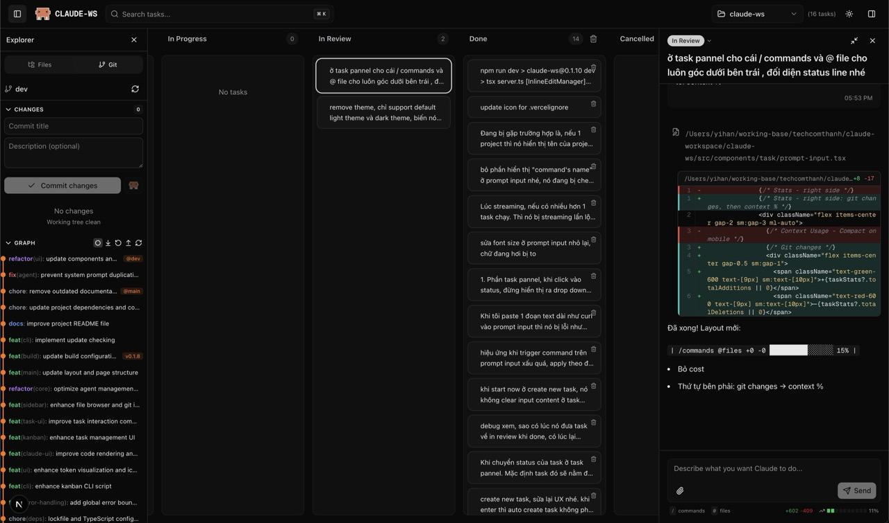

# Claude Workspace

> **DISCLAIMER:** This software is provided "AS IS" without warranty. [Read full disclaimer](./DISCLAIMER.md).

**Visual workspace for Claude Code** — Kanban board, code editor, Git integration, local-first SQLite.



---

## Features

- **Kanban Board** — Drag-and-drop task management with full conversation history
- **Real-time Streaming** — Live Claude responses via Socket.io
- **Checkpoints** — Save and rewind to any conversation state
- **Code Editor** — Tabbed CodeMirror with syntax highlighting and AI suggestions
- **Git Integration** — Status, stage, commit, diff, visual graph
- **Agent Factory** — Plugin system for custom skills, commands, agents
- **Themes** — Light, Dark, VS Code variants, Dracula

---

## Quick Start

**Prerequisites:** Node.js 20+, [Claude Code CLI](https://docs.anthropic.com/en/docs/claude-code)

```bash
# Option 1: npx (quick try)
npx -y claude-ws

# Option 2: Global install (recommended)
npm install -g claude-ws
claude-ws

# Option 3: From source
git clone https://github.com/Claude-Workspace/claude-ws.git
cd claude-ws
pnpm install && pnpm dev
```

Open http://localhost:8556

---

## Configuration

Create `.env` file (or use `~/.claude-ws/.env`):

```bash
# Optional: API authentication for remote access
API_ACCESS_KEY=your-secret-key

# Optional: Custom Claude CLI path
CLAUDE_PATH=/path/to/claude
```

| Variable | Description | Default |
|----------|-------------|---------|
| `PORT` | Server port | `8556` |
| `API_ACCESS_KEY` | API authentication key | (empty) |
| `CLAUDE_PATH` | Claude CLI path | Auto-detected |

---

## Production (PM2)

```bash
npm install -g pm2
pnpm pm2:start    # Start server (auto-builds)
pnpm pm2:logs     # View logs
pnpm pm2:restart  # Restart
pnpm pm2:stop     # Stop
```

---

## Remote Access

For secure remote access, see [Cloudflare Tunnel Setup](./docs/cloudflare-tunnel.md).

---

## Tech Stack

Next.js 16, React 19, SQLite + Drizzle ORM, Socket.io, Tailwind CSS 4, Radix UI, Zustand

---

## License

MIT
