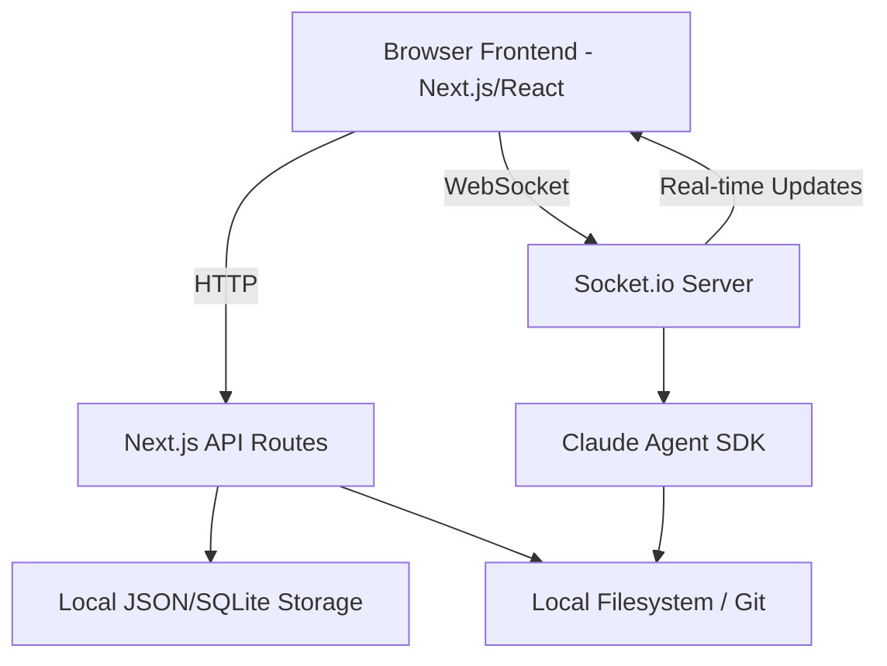

# System Architecture

## High-Level Architecture
Claude Kanban follows a modern full-stack architecture built on Next.js. It bridges the gap between a traditional web-based project management tool and a local development assistant.

## Core Components

### 1. Frontend (React/Zustand)
- **State Stores**: Manage application state (tasks, active project, sidebar configuration).
- **Socket Client**: Handles the real-time stream of assistant messages and terminal output.
- **Git Provider**: Coordinates git status updates and file diffing.

### 2. Backend (Next.js API Routes)
- **Task/Project API**: CRUD operations for the Kanban board.
- **Git API**: Wrapper around local git commands (`status`, `diff`, `stage`, `commit`, `log`).
  - **Remote Detection**: The Log API identifies "local" commits by comparing local history against remote tracking branches (`--remotes`).
  - **Branch Coloring**: The frontend calculator (`src/lib/git/lane-calculator.ts`) assigns deterministic colors based on branch names, prioritizing main/master with amber.

### 3. Agent Integration (Claude SDK)
- **Agent Manager**: Orchestrates the interaction between the user and Claude.
- **Tool System**: Allows Claude to perform actions on the local system (file operations, bash execution).
- **Session Persistence**: Maintains conversation history and allows for rewinding state.

### 4. Real-time Communication (Socket.io)
- Bridges the gap between the long-running Claude SDK sessions and the browser.
- Routes tool execution output and thinking deltas to the UI.
- Manages background shell processes and their standard streams.

## Data Flow: AI Commit Message Generation
1. **Trigger**: User clicks "Generate" button in the Git Panel.
2. **Request**: Frontend sends `POST /api/git/generate-message` with `projectPath`.
3. **Diff Extraction**: Backend executes `git diff --cached` to get staged changes.
4. **AI Processing**:
   - Backend calls `query()` from Claude SDK.
   - Diff content is sent to Claude with a system prompt for conventional commits.
5. **Response Extraction**: Backend parses Claude's response to get the single-line commit message.
6. **Delivery**: Message and diff stats are returned to the frontend.
7. **UI Update**: Frontend updates the commit message input field.
